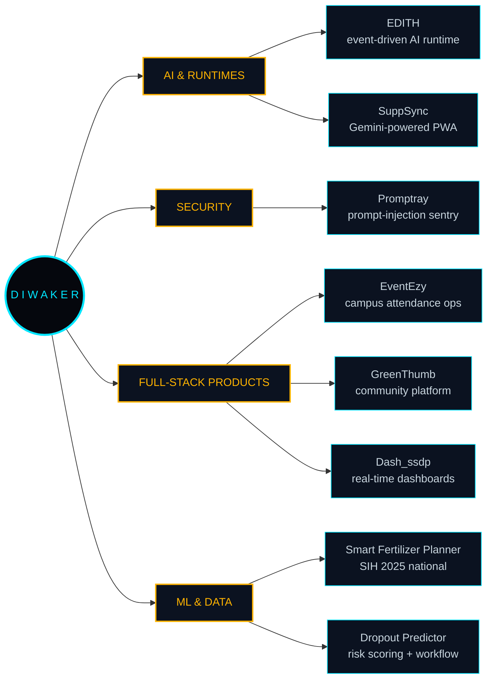

<div align="center">

<!-- ══════════════════════════════════════════════════════════════════ -->
<!--      DIWAKER PANDEY  ·  E.D.I.T.H. PROTOCOL  ·  PROFILE HUD       -->
<!-- ══════════════════════════════════════════════════════════════════ -->


<br/>

<a href="https://linkedin.com/in/diwaker-pandey-32242a211"></a>&nbsp;
<a href="https://github.com/DiwakerPandey21"></a>&nbsp;
<a href="mailto:diwakerp050@gmail.com"></a>

<br/><br/>

&nbsp;
&nbsp;


</div>


<!-- ══════════════════════════════════════════════════════════════════ -->
<!--                        E.D.I.T.H. TERMINAL                        -->
<!-- ══════════════════════════════════════════════════════════════════ -->

<h2 align="center">⟨ E.D.I.T.H. TERMINAL ⟩</h2>

<div align="center">

**EVEN DEAD, I'M THE HERO** — my runtime answers for me. Run a command.

<sub>◈ every line below is clickable ◈ the terminal expands in place ◈</sub>

</div>

<br/>

<details>
<summary><b><code>&nbsp;&gt;&nbsp;edith --whoami&nbsp;</code></b></summary>

<br/>

```

┌──────────────────────────────────────────────────────────────────────────┐
│         E . D . I . T . H .   ::   O P E R A T O R   R E C O R D         │
├──────────────────────────────────────────────────────────────────────────┤
│  OPERATOR   Diwaker Pandey  ::  @DiwakerPandey21  ::  he/him             │
│  BASE       Lovely Professional University, Phagwara, Punjab             │
│  TRACK      B.Tech Computer Science & Engineering  ::  Final Year        │
│  DOMAIN     Full-Stack Engineering / AI Runtimes / Browser Security      │
│  ORIGIN     Sasaram, Bihar  ->  builds things that ship                  │
├──────────────────────────────────────────────────────────────────────────┤
│  CURRENTLY  EDITH      event-driven personal AI runtime                  │
│             Promptray  prompt-injection sentry for agentic browsers      │
│             SuppSync   AI supplement tracker PWA, 60+ features           │
├──────────────────────────────────────────────────────────────────────────┤
│  MOTTO      Build. Break. Rebuild. Repeat.                               │
└──────────────────────────────────────────────────────────────────────────┘

```

</details>

<details>
<summary><b><code>&nbsp;&gt;&nbsp;edith --stack --verbose&nbsp;</code></b></summary>

<br/>

```

┌──────────────────────────────────────────────────────────────────────────┐
│          R E P U L S O R   O U T P U T   D I A G N O S T I C S           │
├──────────────────────────────────────────────────────────────────────────┤
│  JavaScript                [██████████████████████░░]   92%              │
│  React / Next.js           [█████████████████████░░░]   86%              │
│  Node.js / Express         [███████████████████░░░░░]   80%              │
│  AI Integration (Gemini)   [███████████████████░░░░░]   78%              │
│  TypeScript                [██████████████████░░░░░░]   74%              │
│  Supabase / MongoDB        [█████████████████░░░░░░░]   72%              │
│  Python                    [█████████████████░░░░░░░]   70%              │
│  Chrome Extension MV3      [████████████████░░░░░░░░]   68%              │
└──────────────────────────────────────────────────────────────────────────┘

```

</details>

<details>
<summary><b><code>&nbsp;&gt;&nbsp;edith --now&nbsp;</code></b></summary>

<br/>

| Build | What it is | State |
|:--|:--|:--|
| **EDITH** | Event-driven personal AI runtime, modular by design | In development |
| **Promptray** | Chrome extension hunting indirect prompt injection | Phase 3 complete |
| **SuppSync** | AI supplement tracker PWA, 60+ features | Live |

Currently deep in **agentic-browser security** — the attack surface where a
web page can talk directly to someone's AI assistant. Promptray is my answer
to it. EDITH is the other half: a runtime I actually control.

</details>

<details>
<summary><b><code>&nbsp;&gt;&nbsp;edith --hire-me&nbsp;</code></b></summary>

<br/>

```

┌──────────────────────────────────────────────────────────────────────────┐
│                   R E C R U I T E R   B R I E F I N G                    │
├──────────────────────────────────────────────────────────────────────────┤
│  STATUS      OPEN  ::  SDE / Full-Stack / AI Engineer roles              │
│  AVAILABLE   2026 graduate  ::  immediate joiner                         │
│  STRONGEST   React + Next.js + Node + Supabase + LLM integration         │
│  ALSO GOOD   Chrome extensions, MV3 internals, web app security          │
│  EXPERIENCE  Backend intern @ Unified Mentor (May-Aug 2026)              │
│              Freelance web audits + QA reporting for clients             │
│  PROOF       7+ live deployments  ::  26 public repositories             │
├──────────────────────────────────────────────────────────────────────────┤
│  REACH ME    diwakerp050@gmail.com                                       │
│              linkedin.com/in/diwaker-pandey-32242a211                    │
└──────────────────────────────────────────────────────────────────────────┘

```

</details>

<details>
<summary><b><code>&nbsp;&gt;&nbsp;edith --unlock-reactor&nbsp;</code></b> &nbsp;<sub>· classified ·</sub></summary>

<br/>

> **REACTOR LOCKED.** Three gates stand between you and the core.
> Open them in order. No hints. (Fine — there are hints.)

<details>
<summary>&nbsp;<b>GATE I</b> &nbsp;·&nbsp; A web page hides text no human ever sees, written only so an AI agent will obey it. Name the attack.</summary>

<br/>

**Indirect Prompt Injection.** OWASP LLM01. It is the reason I built
**Promptray** — a sentry that reads the page the way your assistant reads it,
not the way you see it.

`GATE I OPEN → key fragment: PRO`

</details>

<details>
<summary>&nbsp;<b>GATE II</b> &nbsp;·&nbsp; A runtime where every capability is a module and nothing talks directly to anything else. What carries the messages?</summary>

<br/>

**An event bus.** Modules publish, modules subscribe, the core stays thin.
That is the spine of **EDITH** — swap a module out mid-flight and the
runtime never notices.

`GATE II OPEN → key fragment: TO`

</details>

<details>
<summary>&nbsp;<b>GATE III</b> &nbsp;·&nbsp; Final gate. Assemble the fragments and speak the word.</summary>

<br/>

```
PRO + TO + COL  =  P R O T O C O L
```

**REACTOR UNLOCKED.** You just did more digging than 99% of people who
land on a GitHub profile. That is exactly the kind of person I want to
build with.

→ Say hello: **[diwakerp050@gmail.com](mailto:diwakerp050@gmail.com)**
Mention the word `PROTOCOL` and I will know you got here the hard way.

</details>

</details>


<!-- ══════════════════════════════════════════════════════════════════ -->
<!--                            SYSTEM MAP                             -->
<!-- ══════════════════════════════════════════════════════════════════ -->

<h2 align="center">⟨ SYSTEM_MAP ⟩</h2>




<!-- ══════════════════════════════════════════════════════════════════ -->
<!--                              ARMORY                               -->
<!-- ══════════════════════════════════════════════════════════════════ -->

<h2 align="center">⟨ ARMORY ⟩</h2>

<div align="center">

<b>◆ LANGUAGES</b>


<b>◆ FRAMEWORKS &amp; RUNTIME</b>


<b>◆ DATA &amp; BACKEND</b>


<b>◆ WORKSHOP</b>


</div>


<!-- ══════════════════════════════════════════════════════════════════ -->
<!--                            SUIT HANGAR                            -->
<!-- ══════════════════════════════════════════════════════════════════ -->

<h2 align="center">⟨ SUIT_HANGAR ⟩</h2>

<div align="center">
<table>
<tr>
<td width="50%" valign="top" align="center">

### 🛰️ EDITH


```
┌────────────────────────────────────────┐
│ MK-VII                      AI RUNTIME │
├────────────────────────────────────────┤
│ Modular, event-driven personal AI      │
│ runtime. Every capability is a hot-    │
│ swappable module on a central event    │
│ bus. EDITH listens, routes, executes.  │
│                                        │
│ > event-bus core, all else subscribes  │
│ > hot-swappable capability modules     │
│ > personal automation + LLM reasoning  │
│ > model-agnostic by design             │
├────────────────────────────────────────┤
│ Python . Event Bus . LLM . Modular     │
│ PWR ████████████░░░░░░░░           60% │
└────────────────────────────────────────┘
```

<a href="https://github.com/DiwakerPandey21/EDITH"></a>

</td>
<td width="50%" valign="top" align="center">

### 🛡️ Promptray


```
┌────────────────────────────────────────┐
│ MK-VI                  SECURITY SENTRY │
├────────────────────────────────────────┤
│ Chrome extension that detects          │
│ indirect prompt injection in the       │
│ wild. Scans pages for payloads aimed   │
│ at hijacking your AI assistant.        │
│                                        │
│ > hidden + cloaked attribute scans     │
│ > unicode / homoglyph / encoded scans  │
│ > shadow DOM + SPA mutation rescanning │
│ > React popup HUD, OWASP LLM01         │
├────────────────────────────────────────┤
│ MV3 . React . TypeScript . AppSec      │
│ PWR ███████████████░░░░░           75% │
└────────────────────────────────────────┘
```

<a href="https://github.com/DiwakerPandey21"></a>

</td>
</tr>
<tr>
<td width="50%" valign="top" align="center">

### 💊 SuppSync


```
┌────────────────────────────────────────┐
│ MK-V                     AI HEALTH PWA │
├────────────────────────────────────────┤
│ Premium AI-powered PWA to track        │
│ supplements, optimize stacks and       │
│ monitor health goals. 60+ features     │
│ shipped across versions V1 to V8.      │
│                                        │
│ > Gemini AI coaching layer             │
│ > XP, streaks, commit-style heatmap    │
│ > real-time PWA notifications          │
│ > offline-first, installable anywhere  │
├────────────────────────────────────────┤
│ Next.js 15 . Gemini . Supabase         │
│ PWR ████████████████████          100% │
└────────────────────────────────────────┘
```

<a href="https://github.com/DiwakerPandey21/Suppsync"></a>

</td>
<td width="50%" valign="top" align="center">

### 🌾 Smart Fertilizer Planner


```
┌────────────────────────────────────────┐
│ MK-IV                         SIH 2025 │
├────────────────────────────────────────┤
│ AI crop advisory for rural farmers.    │
│ Fuses soil telemetry, live weather     │
│ APIs and ML models into a single       │
│ fertilizer recommendation engine.      │
│                                        │
│ > AI fertilizer recommendations        │
│ > live weather API fusion              │
│ > soil analytics dashboard             │
│ > built for low-connectivity users     │
├────────────────────────────────────────┤
│ React . Node . Python . ML             │
│ PWR ████████████████████          100% │
└────────────────────────────────────────┘
```

<a href="https://github.com/DiwakerPandey21"></a>

</td>
</tr>
<tr>
<td width="50%" valign="top" align="center">

### 🎓 Student Dropout Predictor


```
┌────────────────────────────────────────┐
│ MK-III                       ML + MERN │
├────────────────────────────────────────┤
│ ML risk prediction with a counseling   │
│ workflow. Flags at-risk students       │
│ early and triggers intervention        │
│ before the dropout actually happens.   │
│                                        │
│ > risk scoring over student data       │
│ > real-time counselor dashboard        │
│ > intervention + follow-up workflow    │
├────────────────────────────────────────┤
│ MERN . Python . scikit-learn           │
│ PWR ████████████████████          100% │
└────────────────────────────────────────┘
```

<a href="https://github.com/DiwakerPandey21"></a>

</td>
<td width="50%" valign="top" align="center">

### 📋 EventEzy


```
┌────────────────────────────────────────┐
│ MK-II                       CAMPUS OPS │
├────────────────────────────────────────┤
│ Smart attendance system replacing      │
│ Google Forms and Excel sheets for      │
│ large-scale campus events. Deployed    │
│ for clubs at LPU.                      │
│                                        │
│ > event-scoped attendance capture      │
│ > organizer dashboard + CSV export     │
│ > handles high-volume check-ins        │
├────────────────────────────────────────┤
│ JavaScript . Node . REST APIs          │
│ PWR ████████████████████          100% │
└────────────────────────────────────────┘
```

<a href="https://github.com/DiwakerPandey21/EventEzy"></a>

</td>
</tr>
<tr>
<td width="50%" valign="top" align="center">

### 🌿 GreenThumb Community


```
┌────────────────────────────────────────┐
│ MK-I                         COMMUNITY │
├────────────────────────────────────────┤
│ A community platform where gardeners   │
│ share, learn and grow together.        │
│ Fully responsive, content-driven       │
│ social layer.                          │
│                                        │
│ > community feed + knowledge base      │
│ > responsive TypeScript front end      │
│ > clean, accessible UI system          │
├────────────────────────────────────────┤
│ TypeScript . React . Node              │
│ PWR ██████████████████░░           90% │
└────────────────────────────────────────┘
```

<a href="https://github.com/DiwakerPandey21/GreenThumb"></a>

</td>
<td width="50%" valign="top" align="center">

### 📊 Dash_ssdp


```
┌────────────────────────────────────────┐
│ MK-0                          DATA VIZ │
├────────────────────────────────────────┤
│ Real-time data collection and          │
│ visualization platform. Dashboards     │
│ that speak louder than the             │
│ spreadsheets they replaced.            │
│                                        │
│ > live ingest + chart rendering        │
│ > configurable dashboard widgets       │
│ > API-driven data sources              │
├────────────────────────────────────────┤
│ JavaScript . Charts . REST APIs        │
│ PWR █████████████████░░░           85% │
└────────────────────────────────────────┘
```

<a href="https://github.com/DiwakerPandey21/Dash_ssdp"></a>

</td>
</tr>
</table>
</div>


<!-- ══════════════════════════════════════════════════════════════════ -->
<!--                         SYSTEM DIAGNOSTICS                        -->
<!-- ══════════════════════════════════════════════════════════════════ -->

<h2 align="center">⟨ SYSTEM_DIAGNOSTICS ⟩</h2>

<div align="center">


<br/><br/>


<br/><br/>


</div>


<!-- ══════════════════════════════════════════════════════════════════ -->
<!--                           CLEARANCE LOG                           -->
<!-- ══════════════════════════════════════════════════════════════════ -->

<h2 align="center">⟨ CLEARANCE_LOG ⟩</h2>

```

┌──────────────────────────────────────────────────────────────────────────┐
│                        C L E A R A N C E   L O G                         │
├──────────────────────────────────────────────────────────────────────────┤
│  [ UNLOCKED ]  Smart India Hackathon 2025    ::  National Level          │
│  [ UNLOCKED ]  Security Research             ::  OWASP LLM01 work        │
│  [ UNLOCKED ]  AI Runtime Architect          ::  EDITH modular core      │
│  [ UNLOCKED ]  Shipped Full-Stack Operator   ::  7+ live deployments     │
│  [ UNLOCKED ]  Open Source Contributor       ::  26 public repos         │
│  [ UNLOCKED ]  Commit Discipline             ::  215 contributions/yr    │
│  [ UNLOCKED ]  Backend Internship            ::  Unified Mentor 2026     │
└──────────────────────────────────────────────────────────────────────────┘

```

<div align="center">

&nbsp;
&nbsp;
&nbsp;


</div>


<!-- ══════════════════════════════════════════════════════════════════ -->
<!--                        CERTIFICATION VAULT                        -->
<!-- ══════════════════════════════════════════════════════════════════ -->

<h2 align="center">⟨ CERTIFICATION_VAULT ⟩</h2>

<div align="center">

| ◆ | Certification | Issuer | Status |
|:---:|:---|:---|:---:|
| ⬡ | **Computational Theory** | Skillsoft |  |
| ⬡ | **Bits &amp; Bytes of Computer Networking** | Google |  |
| ⬡ | **Introduction to Hardware and OS** | IBM |  |
| ⬡ | **Networking Specialization** | University of Colorado |  |

<br/>

<a href="https://linkedin.com/in/diwaker-pandey-32242a211"></a>

</div>


<!-- ══════════════════════════════════════════════════════════════════ -->
<!--                          NANOTECH SWARM                           -->
<!-- ══════════════════════════════════════════════════════════════════ -->

<h2 align="center">⟨ NANOTECH_SWARM ⟩</h2>

<div align="center">

<sub>the swarm consumes every commit in the grid</sub>

<br/><br/>

<picture>
  <source media="(prefers-color-scheme: dark)" srcset="https://raw.githubusercontent.com/DiwakerPandey21/DiwakerPandey21/output/github-contribution-grid-snake-dark.svg" />
  <source media="(prefers-color-scheme: light)" srcset="https://raw.githubusercontent.com/DiwakerPandey21/DiwakerPandey21/output/github-contribution-grid-snake.svg" />
  
</picture>

</div>


<!-- ══════════════════════════════════════════════════════════════════ -->
<!--                           COMMS CHANNEL                           -->
<!-- ══════════════════════════════════════════════════════════════════ -->

<h2 align="center">⟨ COMMS_CHANNEL ⟩</h2>

<div align="center">

<a href="https://linkedin.com/in/diwaker-pandey-32242a211"></a>&nbsp;&nbsp;
<a href="mailto:diwakerp050@gmail.com"></a>&nbsp;&nbsp;
<a href="https://github.com/DiwakerPandey21"></a>

</div>

```

┌──────────────────────────────────────────────────────────────────────────┐
│                                                                          │
│    "  Sometimes you gotta run before you can walk.  "                    │
│                                                                          │
│    I don't wait for the perfect stack. I build, break and                │
│    rebuild until the thing actually flies.                               │
│                                                                          │
│                                        --  Diwaker Pandey                │
│                                                                          │
└──────────────────────────────────────────────────────────────────────────┘

```

<div align="center">


</div>
